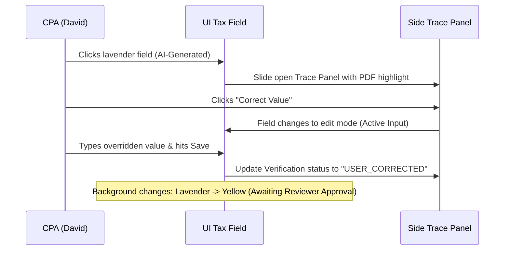

# AI Trust Model & Transparency Specification

This document details how AI decisions, data extractions, confidence scoring, and override workflows are presented to the user to ensure transparency without overwhelming cognitive load.

## 1. Unified AI-Output Data Contract (JSON)

Every AI-extracted field is backed by a structured data object simulating the metadata payload.

```json
{
  "fieldId": "f1040_line1z",
  "fieldName": "Wages, Salaries, and Tips",
  "extractedValue": 152500.00,
  "confidenceState": "HIGH", 
  "confidenceExplanation": "Extracted from clear W-2 form Box 1 with matching employer EIN and employee SSN.",
  "evidence": [
    {
      "documentId": "doc-w2-john",
      "documentName": "W2_John_Miller_2025.pdf",
      "pageNumber": 1,
      "boundingBox": { "x": 120, "y": 450, "width": 80, "height": 20 },
      "extractionMatchText": "152,500.00"
    }
  ],
  "transformation": {
    "type": "DIRECT_MAPPING",
    "formula": "W-2 Box 1",
    "steps": [
      { "description": "Read Box 1 from W2_John_Miller_2025.pdf", "value": 152500.00 }
    ]
  },
  "uncertaintyReason": null,
  "suggestedNextAction": "Verify field matches W-2 document highlight",
  "verification": {
    "status": "UNVERIFIED",
    "verifiedBy": null,
    "verifiedAt": null,
    "originalValueBeforeCorrection": null
  },
  "simulatedDisclosure": "This data was generated by a mock AI service for demo purposes."
}
```

---

## 2. Explanation of Confidence States (No False Precision)

Instead of showing arbitrary values like "92.4% Confidence" (which creates false security), the UI uses categorizations with concrete reasons:

1. **High Confidence (HIGH)**:
   - *UI Presentation*: Green `Sparkles` icon (SVG, see [[docs/INTERACTION_SYSTEM.md]] §1), checkmark helper, text badge "HIGH".
   - *Meaning*: Perfect document readability, matching cross-references (e.g., matching totals on W-2 and payroll summary), standard template.
2. **Medium/Uncertain (MEDIUM)**:
   - *UI Presentation*: Yellow `Sparkles` icon, `TriangleAlert` warning icon, text badge "MEDIUM".
   - *Meaning*: Smudged or blurry document scan, hand-written fields, or no prior template history. Explicit reason shown: *"Hand-written numbers require human review."*
3. **Conflicting Evidence (CONFLICT)**:
   - *UI Presentation*: Double red highlights, `OctagonX` icon, text badge "CONFLICT".
   - *Meaning*: Two separate source documents claim different values for the same tax item. Reason: *"W-2 Box 1 value does not match 1099-NEC statement."*
4. **Missing Evidence (MISSING)**:
   - *UI Presentation*: Empty field with red dashed border, `CircleHelp` icon, text badge "MISSING".
   - *Meaning*: Tax calculation requires a figure that cannot be found on any uploaded source document. Reason: *"Schedule K-1 is missing from the document locker."*

---

## 3. Human-in-the-Loop Correction Workflow

To build trust, the CPA must be able to override the AI easily without leaving the active context.



---

## 4. Verification & Audit Trail

Once an override or verification occurs, the record updates its metadata:
- **State: USER_CORRECTED**:
  - Requires Reviewer sign-off.
  - Stores `originalValueBeforeCorrection` so reviewer can compare side-by-side.
- **State: REVIEWER_VERIFIED**:
  - Locked field.
  - Displays avatar badge: *"Marcus Vance verified at 2026-07-17 18:16"*
  - Read-only for Preparers; requires manager credential to unlock.

---

## 5. Simulated-Data Disclosure

A persistent thin bar at the bottom of the workspace displays:
> ℹ **Prototype Simulation Mode**: Tax computations and document extractions are mock simulations. No real tax filings are submitted.
