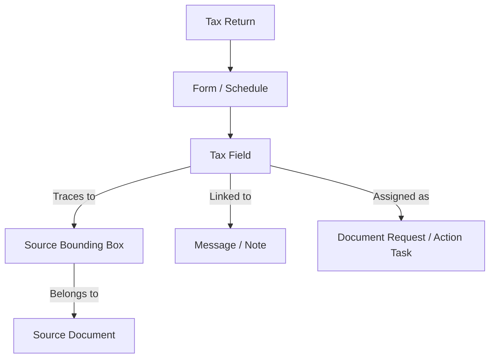

# Information Architecture and Navigation Map

This document outlines the routing, navigation structures, and data visibility rules across different user roles in the platform.

## 1. Routing and Navigation Schema

The application navigation is built around a single-page app framework with structural routing parameters.

### App Navigation Hierarchy
```
/ (Root)
├── /login (Simulated auth screen)
├── /dashboard (Role-aware dashboard landing)
│   ├── /dashboard/preparer (Actions list, client queues)
│   ├── /dashboard/reviewer (Awaiting approval queue, audit controls)
│   └── /dashboard/client (Onboarding checklist, uploaded docs)
├── /return/:returnId (Workspace layout - split pane view)
│   ├── /return/:returnId/summary (Form 1040 / 1120 summary page)
│   ├── /return/:returnId/schedule/:scheduleId (Detailed schedules, e.g., Schedule C)
│   └── /return/:returnId/documents (Uploaded files list)
├── /onboarding (Step-by-step first-time setup flow)
└── /settings (Account setup and role toggle configurations)
```

### Deep-Link Query Parameters
To prevent users from getting lost, URLs encode active sidebar tabs and active form fields:
- **Example URL**: `/return/ret-miller-1040/schedule/Wages?field=box1_amount&drawer=collab&message=msg-882`
  - `field`: Highlights the specific field (`box1_amount`).
  - `drawer`: Opens the side panel to collaboration (`collab`).
  - `message`: Focuses a specific chat message/thread.

---

## 2. Navigational Modes

### A. Global Navigation
A top header bar present across all screens:
- **Left**: Platform Branding + Home link.
- **Center**: Global Search (Command-bar style, search files, clients, returns, forms).
- **Right**:
  - **Role Switcher Dropdown** (switches active view: Preparer, Reviewer, Client).
  - **Workspace Mode Toggler** (only visible for firm employees with personal tax files to toggle "Firm Mode" vs "Personal Mode").
  - **Profile Avatar** (shows active user name, role badge).
  - **Persistent Role/Context Label** (always visible, e.g. "Reviewer — Apex Tax Solutions" or "Personal"): identifies active role and active organization-vs-personal context by label, layout, and icon, never by color alone.
  - **Permission Summary Banner** (top of active screen): states current access in plain language, e.g. "Reviewer Mode — Read/Write on assigned returns, sign-off enabled." Appears for every role, not only client-facing screens.

Switching role or context never re-themes the product's color palette. One visual identity persists across all six roles; only the label, nav items, and permission summary change. If unsaved changes exist when a context switch is requested, a confirmation dialog interrupts the switch ("You have unsaved changes. Discard or save before switching to Client Portal?").

### Six-Role Permission Model
The permission and role model represents all six roles defined by the assessment (individual taxpayer, business owner, preparer, reviewer, firm administrator, seasonal staff) even though the primary interactive demonstration focuses on three of them — client (individual/business owner), preparer, and reviewer — per [[docs/DEMO_JOURNEYS.md]]. Firm administrator and seasonal staff have defined permission entries (e.g., admin: manage users/routing, full firm visibility; seasonal staff: data entry + document intake, no sign-off, no client-financial visibility beyond assigned tasks) even where no dedicated screen is built for them.

### B. Role-Aware Navigation
The sidebar navigation panel adapts dynamically:
- **Firm Staff (Preparer/Reviewer/Admin/Seasonal)**:
  - Dashboard (Action center)
  - Returns Queue (List of all returns in progress/filed)
  - Client Manager (Contact directory, entities)
  - Document Intake (Master queue of uploaded files awaiting classification)
- **Client (Individual/Business Owner)**:
  - Home (Onboarding steps/Current stage)
  - Required Actions (Unfilled questionnaires, requested uploads)
  - Document Locker (Secure storage of historic returns and files)
  - Messages (Direct chat line to preparer)

### C. Contextual Navigation (Split-Pane Workspace)
When inside a Return Workspace, navigation uses a left-to-right hierarchy:
1. **Forms Checklist (Left Panel)**: Tree view showing Form 1040, Schedule A, Schedule C, etc.
2. **Interactive Form (Center Panel)**: Interactive tax fields with visual status markers.
3. **Trace/Collab Drawer (Right Panel)**: Dynamic panel showing source PDFs, trace calculators, chats, or tasks linked to the currently selected field in the center panel.

---

## 3. Connected-Object Relationships

Every object in the app maintains relationship references to allow seamless traversal:


---

## 4. Context Preservation & Return to Prior Workflow

- **Breadcrumbs**: Standard format displayed at top of return: `Dashboard / Client List / Miller, John (1040) / Schedule C / Line 12 (Travel)`. Clicking parent levels takes the user back without losing scroll positions or field states.
- **State Capture**: When moving between views (e.g., jumping from return workspace to client message, then back), the route path registers `returnTo` parameters:
  - `onboarding?returnTo=/return/ret-miller-1040`
- **Context Drawer History**: The Trace/Collab drawer maintains a "Back" button representing visited tabs (e.g., `Trace ⮞ Chat ⮞ Document View`).

---

## 5. Client vs. Staff Information Visibility

To ensure confidentiality and prevent confusion:

| Information / Surface | Firm Staff Visible | Client Visible | Rationale |
| :--- | :--- | :--- | :--- |
| **Form Fields & Trace Bbox** | YES (Full access) | YES (Read-only) | Clients need transparency but shouldn't alter formulas. |
| **Firm Internal Notes** | YES (Add/edit/view) | **NO (Hidden)** | Internal deliberations must remain private to the firm. |
| **Client Messages** | YES (Read-write) | YES (Read-write) | Shared communication channel. |
| **AI Confidence Scores** | YES (Visual badges) | **NO (Simplified)** | High/Low metrics prevent client panic; staff need exact details. |
| **Review Milestones** | YES (Complete audit log)| YES (Simple timeline) | Client sees "Under Review"; staff see "Awaiting Marcus sign-off". |
| **Calculation Details** | YES (Trace panel formulas) | YES (Simplified explanation)| Educates client, reduces support questions. |
